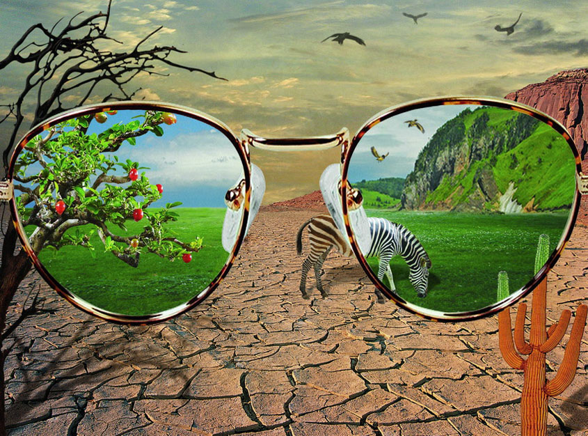
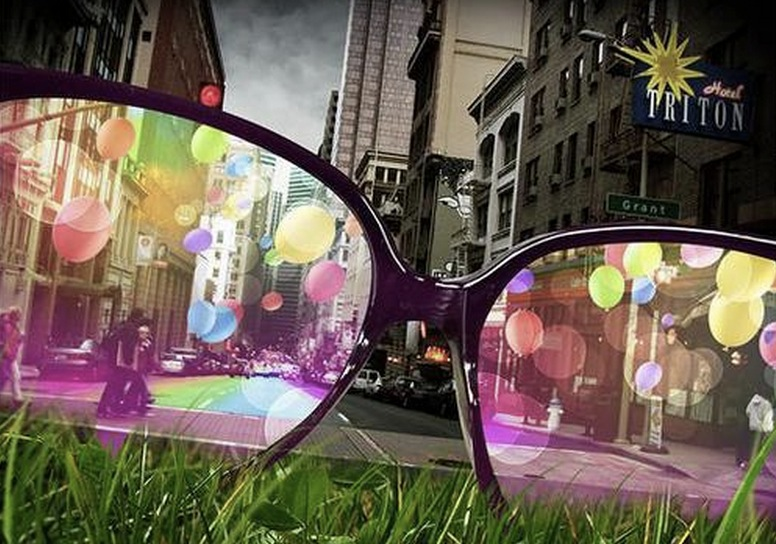
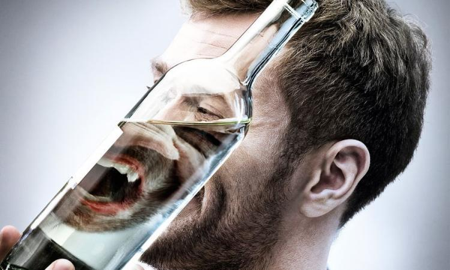
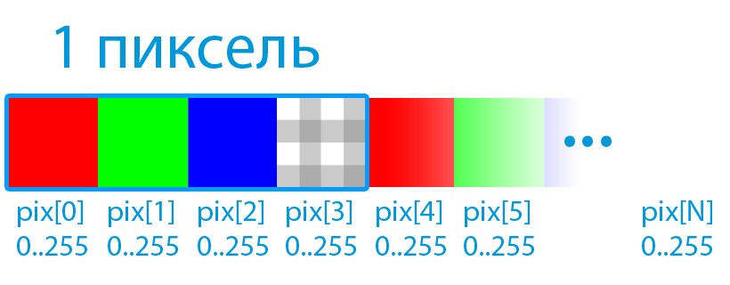
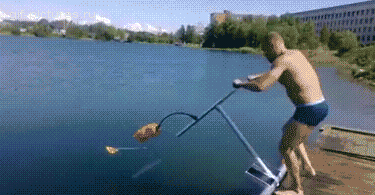
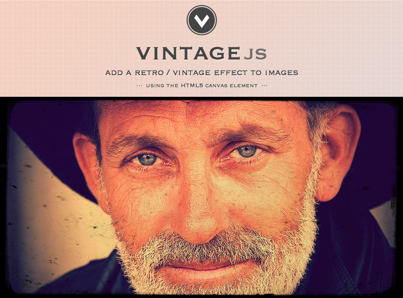
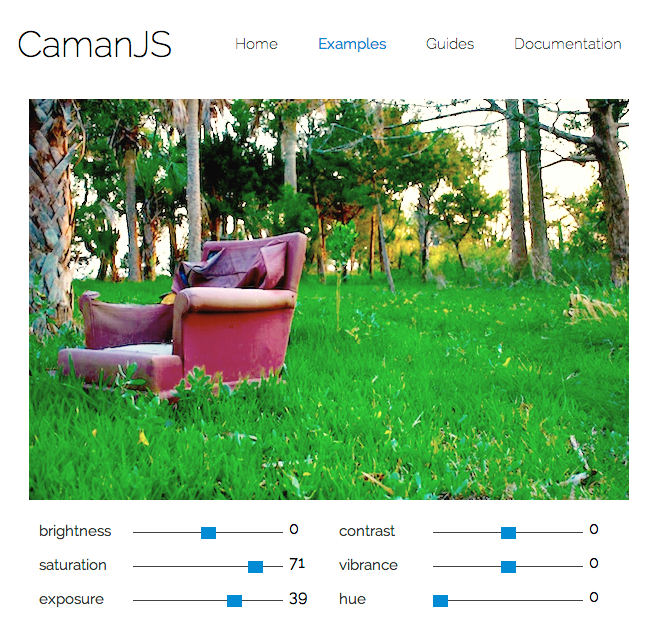
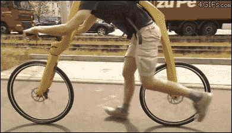
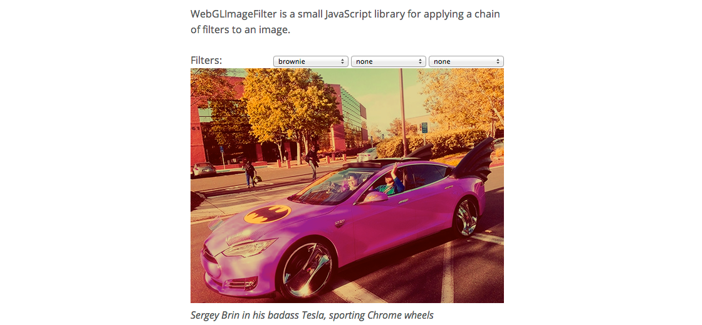

---

layout: bright

style: |

---

# Как  сделать  Instagram  в браузере {#Cover}

**Дмитрий Дудин [@nedudi](http://twitter.com/nedudi)  РИТ++ 2014 Москва**

## Преукрасить
{:.h.w.cover.cover-eye #eye2}

## Придать настроение
{:.h.w.cover.cover-eye #eye1}

## Нелинейные искажения
{:.h.w.cover.cover-eye #eye3}

## Устоявшиеся практики
<ul>
  <li>Десктопный софт:
    <ul>
      <li class="next">Photoshop</li>
      <li class="next">Photobooth osx, XnRetro ...</li>
    </ul>
  </li>
  <li class="next">Мобильные приложения:
    <ul>
      <li class="next">Instagram</li>
      <li class="next">Snapseed, Camera+ и еще 100500 разных...</li>
    </ul>
  </li>
</ul>

## Фильтрация в веб  несколько лет назад

<ol>
  <li>Flash</li>
  <li class="next">Отправляем на сервер,  там фильтруем,  возвращаем обратно на клиент  и все это время ждем, ждем, ждем...</li>
</ol>

## Все меняется к лучшему
{:.cover #allgood}

## Способы фильтрации на клиенте сегодня и в ближайшем будущем:

1. …Canvas
2. …WebGL
3. …SVG-фильтры
4. …SVG-фильтры для HTML
5. …CSS-фильтры
6. …CSS Shaders

## **Canvas**
{:.cover #hhh1}

## Canvas data
{:.code12.noheader}

    var canvas = document.createElement('canvas');
    var context = canvas.getContext('2d');
    context.drawImage(img);
    var imgd = context.getImageData(0, 0, w, h)
    var pixels = imgd.data;

 

## Не нужно изобретать свой велосипед
{:.code13}

---

## vintageJS
{:.code12}

    $(img).vintage({
      <mark>contrast:<mark>32</mark>,</mark>
      <mark>lighten:<mark>0.4</mark>,</mark>
      <mark>noise: <mark>20</mark>,</mark>
      <mark>desaturate: <mark>0.05</mark></mark>
    });

---

## camanJS
{:.code11}

    Caman("image.jpg", "#canvas", function () {
      this
        <mark>.saturation(<mark>20</mark>)</mark>
        <mark>.gamma(<mark>1.4</mark>)</mark>
        <mark>.vignette(<mark>300, 60</mark>)</mark>
        <mark>.render();</mark>
    });

## Достоинства фильтрации с Canvas

1. …IE 9 + и мобильные браузеры.
2. …Много готовых решений, библиотек, плагинов.
3. …Фильтры могут быть настолько сложными и нестандартными, насколько у вас хватит фантазии  . . .  и насколько вы разбираетесь в цифровой обработке изображений :)

## Недостатки фильтрации с Canvas

1. …Нельзя отфильтровать картинки с других доменов (включая поддомены) из-за ограничений безопасности. Решается проксированием или переводом в base64.
2. …Сложные фильтры это медленная, блокирующая операция.  Десктопный браузер подтормаживает... Мобильный браузер серьезно тупит.

## **WebGL**
{:.cover #hhh2}

## Что это о_O ?
{:.codepl200.code10}

    precision mediump float;
    varying vec2 position;
    uniform sampler2D webcam;

    void main() {
      vec2 p = position;
      vec4 color = texture2D(webcam, p);
      color.rgb = 1.0 - color.rgb;
      gl_FragColor = color;
    }

## Шейдеры 

* …Шейдер - кусок кода, который описывает алгоритм обработки каждого пикселя в GPU. 
* …Достоинство -  возможность пользоваться параллельной архитектурой GPU.
* …Бывают векторными и пиксельными (Fragment Shaders) 
* …Описываются в синтаксисе GLSL (OpenGL Shading Language)

## Вернемся к "cтрашному" шейдеру
{:.codepl200.code10}

    precision mediump float;
    varying vec2 position;
    uniform sampler2D webcam;

    void main() {
      vec2 p = position;
      vec4 color = texture2D(webcam, p);
      <mark>color.rgb = 1.0 - color.rgb;</mark>
      gl_FragColor = color;
    }

## Велосипеды в WebGl - это больно
{:.code13}

## glfx
{:.code13.cover.w.h.noheader}

## Достоинства glfx

1. …Множество предустановленных фильтров.
2. …Красивый и понятный API.
3. …Возможность расширять библиотеку своими шейдерами.

## WebGLImageFilter

## WebGLImageFilter прост в использовании
{:.code13}

    var filter = new WebGLImageFilter();
    filter.addFilter(<mark>'hue', 180</mark>);
    filter.addFilter(<mark>'negative'</mark>);
    filter.addFilter(<mark>'blur', 7</mark>);
    var filteredImage = filter.apply(inputImage);

## Достоинства фильтрации с WebGL

1. …Очень, очень, очень быстро.
2. …Есть несколько хороших плагинов.
3. …Можно ре-использовать любые шейдеры 
 написаные за 14 лет 
 для OpenGL на GLSL c 2001 года.

## Недостатки фильтрации с WebGL

1. …Слабая поддержка браузерами. Chrome, Opera - отлично, FF, Safari, IE11 - частично, все остальные - никак.
2. …Нельзя отфильтровать картинки с других доменов (включая поддомены) из-за ограничений безопасности. Решается проксированием или переводом в base64.

## **SVG filters**
{:.cover #hhh3}

## Нарисуем круг
{:.code14.codepl100}

    <svg width="400" height="400">
        <circle 
          cx="200" 
          cy="200" 
          fill="#3498db" 
          r="100"/>
    </svg>

## Это круг :)

<svg width="400" height="400">
    <circle cx="200" cy="200" fill="#3498db" r="100"/>
</svg>

## Простейший svg-фильтр (blur)
{:.codepl100}

    <svg width="400" height="400">
      <mark><defs></mark>
        <filter id="f0">
          <feGaussianBlur stdDeviation="50" />
        </filter>
      <mark></defs></mark>
      <circle filter="url(#f0)" cx="200" cy="200" 
      fill="#3498db" r="100"/>
    </svg>

## Простейший svg-фильтр (blur)
{:.codepl100}

    <svg width="400" height="400">
      <defs>
        <mark><filter id="f0"></mark>
          <feGaussianBlur stdDeviation="50" />
        <mark></filter></mark>
      </defs>
      <circle filter="url(#f0)" cx="200" cy="200" 
      fill="#3498db" r="100"/>
    </svg>

## Простейший svg-фильтр (blur)
{:.codepl100}

    <svg width="400" height="400">
      <defs>
        <filter id="f0">
          <mark><feGaussianBlur stdDeviation="50" /></mark>
        </filter>
      </defs>
      <circle filter="url(#f0)" cx="200" cy="200" 
      fill="#3498db" r="100"/>
    </svg>

## Простейший svg-фильтр (blur)
{:.codepl100}

    <svg width="400" height="400">
      <defs>
        <mark><filter <mark>id="f0"</mark> ></mark>
          <feGaussianBlur stdDeviation="40" />
        <mark></filter></mark>
      </defs>
      <circle <mark>filter="url(<mark>#f0</mark>)"</mark> cx="200" cy="200" 
      fill="#3498db" r="100"/>
    </svg>

## Результат

<svg width="400" height="400">
  <defs>
    <filter overflow="visible" x="-50%" y="-50%" width="250%" height="250%" id="f112">
      <feGaussianBlur  stdDeviation="40" />
    </filter>
  </defs>
  <circle  clipPathUnits='userSpaceOnUse' cx="200" cy="200" fill="#3498db" filter="url(#f112)" r="100"/>
</svg>

## Картинка внутри SVG
{:.code14.codepl150}

    <svg width="1024" height="768">
      <image 
        width="100%" 
        height="100%"  
        <mark>xlink:href="img/girl.jpg"</mark> />
    </svg>

## Картинка внутри SVG + blur

    <svg width="1024" height="768">
      <defs>
        <mark><filter <mark>id="f1"</mark> ></mark>
          <feGaussianBlur stdDeviation="10" />
        <mark></filter></mark>
      </defs>
      <image <mark>filter="url(<mark>#f1</mark>)"</mark> xlink:href="img/girl.jpg" 
      width="100%" height="100%" />
    </svg>

## Картинка внутри SVG
{:.cover.w.h.headerlabel}

<svg class="cover" width="1024" height="768">
  <image width="100%" height="100%" xlink:href="img/girl.jpg"/>
</svg>

## Картинка внутри SVG + blur
{:.cover.w.h.headerlabel}

<svg class="cover" width="1024" height="768">
  <defs>
    <filter id="f1">
      <feGaussianBlur stdDeviation="10" />
    </filter>
  </defs>
  <image filter="url(#f1)" xlink:href="img/girl.jpg" 
  width="100%" height="100%" />
</svg>

## Комбинация фильтров
{:.code10}

    <filter id="f2">
      <feGaussianBlur stdDeviation="3" />
      <feColorMatrix type="saturate" values="0">
      </feColorMatrix>
    </filter>

## Комбинация фильтров
{:.code10}

    <filter id="f2">
      <feGaussianBlur <mark>result="<mark>a1</mark>"</mark> stdDeviation="3" /></mark>
      <feColorMatrix type="saturate" values="0">
      </feColorMatrix>
    </filter>

## Комбинация фильтров
{:.code10}

    <filter id="f2">
      <feGaussianBlur result="a1" stdDeviation="3" />
      <feColorMatrix <mark>in="<mark>a1</mark>"</mark> type="saturate" values="0">
      </feColorMatrix>
    </filter>

## Комбинация фильтров
{:.code10}

    <filter id="f2">
      <feGaussianBlur <mark>result="<mark>a1</mark>"</mark> stdDeviation="3" />
      <feColorMatrix <mark>in="<mark>a1</mark>"</mark> type="saturate" values="0">
      </feColorMatrix>
    </filter>

## Комбинация фильтров
{:.cover.w.h.headerlabel}

<svg width="1024" height="768" >
  <defs>
    <filter id="f2">
      <feGaussianBlur in="SourceGraphic" result="a1" stdDeviation="3" />
      <feColorMatrix in="a1" type="saturate" values="0">
        
      </feColorMatrix>
    </filter>
  </defs>
  <image filter="url(#f2)" xlink:href="img/girl.jpg" width="100%" height="100%" />
</svg>

## **типы SVG фильтров  &lt;fe...Фильтр&gt;**

## **feComponentTransfer**

## feComponentTransfer
{:.code10}
    <feComponentTransfer>
      <<mark>feFunc<mark>R</mark></mark> type="linear" slope="5" intercept="-0.5"/>
      <<mark>feFunc<mark>G</mark></mark> type="linear" slope="0.2"/>
      <<mark>feFunc<mark>B</mark></mark> type="linear" slope="0.2"/>
      <<mark>feFunc<mark>A</mark></mark> type="identity"/>
    </feComponentTransfer>

## feComponentTransfer
{:.cover.w.h.headerlabel}

<svg class="cover" width="1024" height="768">
    <defs>
        <filter id="f30" >
          <feComponentTransfer>
            <feFuncR type="linear" slope="5" intercept="-0.5"/>
            <feFuncG type="linear" slope="0.2"/>
            <feFuncB type="linear" slope="0.2"/>
            <feFuncA type="identity"/>
          </feComponentTransfer>
        </filter>
    </defs>
    <image filter="url(#f30)" xlink:href="img/girl.jpg" width="100%" height="100%"  preserveAspectRatio="xMidYMid meet"/>
</svg>

## feComponentTransfer
{:.code14}

    <feComponentTransfer>
      <<mark>feFunc<mark>A</mark></mark> type="linear" <mark>slope="<mark>0.5</mark>"</mark>/>
    </feComponentTransfer>

## feComponentTransfer
{:.cover.w.h.headerlabel}

<svg style="background-image:url('img/transp.png')" class="cover" width="1024" height="768">
    <defs>
        <filter id="f31" >
          <feComponentTransfer>
            <feFuncA type="linear" slope="0.5"/>
          </feComponentTransfer>
        </filter>
    </defs>
    <image filter="url(#f31)" xlink:href="img/girl.jpg" width="100%" height="100%"  preserveAspectRatio="xMidYMid meet"/>
</svg>

## feComponentTransfer
{:.code14}

    <feComponentTransfer>
      <<mark>feFunc<mark>R</mark></mark> type="linear" <mark>slope="<mark>0</mark>"</mark>/>
      <<mark>feFunc<mark>G</mark></mark> type="linear" <mark>slope="<mark>0</mark>"</mark>/>
      <<mark>feFunc<mark>B</mark></mark> type="linear" <mark>slope="<mark>1</mark>"</mark>/>
    </feComponentTransfer>

## feComponentTransfer
{:.cover.w.h.headerlabel}

<svg class="cover" width="1024" height="768">
    <defs>
        <filter id="f32" >
          <feComponentTransfer>
            <feFuncR type="linear" slope="0"/>
            <feFuncG type="linear" slope="0"/>
            <feFuncB type="linear" slope="1"/>
          </feComponentTransfer>
        </filter>
    </defs>
    <image filter="url(#f32)" xlink:href="img/girl.jpg" width="100%" height="100%"  preserveAspectRatio="xMidYMid meet"/>
</svg>

## feComponentTransfer
{:.code10}

    <feComponentTransfer>
     <feFuncR type="linear" slope="10" intercept="-4"/>
     <feFuncG type="linear" slope="1.5" intercept="1"/>
     <feFuncB type="linear" slope="2" intercept="-1"/>
    </feComponentTransfer>

## feComponentTransfer
{:.cover.w.h.headerlabel}

<svg class="cover" width="1024" height="768">
    <defs>
        <filter id="f33" >
          <feComponentTransfer>
           <feFuncR type="linear" slope="10" intercept="-4"/>
           <feFuncG type="linear" slope="1.5" intercept="1"/>
           <feFuncB type="linear" slope="2" intercept="-1"/>
          </feComponentTransfer>
        </filter>
    </defs>
    <image filter="url(#f33)" xlink:href="img/girl.jpg" width="100%" height="100%"  preserveAspectRatio="xMidYMid meet"/>
</svg>

## feComponentTransfer
{:.code10}
    <feComponentTransfer>
      <<mark>feFunc<mark>R</mark></mark> <mark>type="<mark>discrete</mark>"</mark> <mark>tableValues="<mark>0 0.5 1</mark>"</mark> />
      <<mark>feFunc<mark>G</mark></mark> <mark>type="<mark>discrete</mark>"</mark> <mark>tableValues="<mark>0 0.5 1</mark>"</mark> />
      <<mark>feFunc<mark>B</mark></mark> <mark>type="<mark>discrete</mark>"</mark> <mark>tableValues="<mark>0 0.5 1</mark>"</mark> />
    </feComponentTransfer>

## feComponentTransfer
{:.cover.w.h.headerlabel}

<svg class="cover" width="1024" height="768">
    <defs>
        <filter id="f34" >
          <feComponentTransfer>
            <feFuncR type="discrete" tableValues="0 0.5 1"/>
            <feFuncG type="discrete" tableValues="0 0.5 1"/>
            <feFuncB type="discrete" tableValues="0 0.5 1"/>
          </feComponentTransfer>
        </filter>
    </defs>
    <image filter="url(#f34)" xlink:href="img/girl.jpg" width="100%" height="100%"  preserveAspectRatio="xMidYMid meet"/>
</svg>

## feComponentTransfer
{:.code11}
    <feComponentTransfer>
      <<mark>feFunc<mark>R</mark></mark> <mark>type="<mark>table</mark>"</mark> <mark>tableValues="<mark>1 0</mark>"</mark> />
      <<mark>feFunc<mark>G</mark></mark> <mark>type="<mark>table</mark>"</mark> <mark>tableValues="<mark>1 0</mark>"</mark> />
      <<mark>feFunc<mark>B</mark></mark> <mark>type="<mark>table</mark>"</mark> <mark>tableValues="<mark>1 0</mark>"</mark> />
    </feComponentTransfer>

## feComponentTransfer
{:.cover.w.h.headerlabel}

<svg class="cover" width="1024" height="768">
    <defs>
        <filter id="f36" >
          <feComponentTransfer>
            <feFuncR type="table" tableValues="1 0"/>
            <feFuncG type="table" tableValues="1 0"/>
            <feFuncB type="table" tableValues="1 0"/>
          </feComponentTransfer>
        </filter>
    </defs>
    <image filter="url(#f36)" xlink:href="img/girl.jpg" width="100%" height="100%"  preserveAspectRatio="xMidYMid meet"/>
</svg>

## feComponentTransfer
{:.code13}
    <feComponentTransfer>
      <<mark>feFuncR</mark> <mark>type="gamma"</mark> 
      amplitude="2" exponent="0.5" offset="0.2"/>
    </feComponentTransfer>

## feComponentTransfer
{:.cover.w.h.headerlabel}

<svg class="cover" width="1024" height="768">
    <defs>
        <filter id="f37" >
          <feComponentTransfer>
            <feFuncR type="gamma" amplitude="2" exponent="0.5" offset="0.2"/>
          </feComponentTransfer>
        </filter>
    </defs>
    <image filter="url(#f37)" xlink:href="img/girl.jpg" width="100%" height="100%"  preserveAspectRatio="xMidYMid meet"/>
</svg>

## **feColorMatrix**

## feColorMatrix
{:.code12.codecenter.cover.w.h.headerlabel}
    
    <<mark>feColorMatrix</mark> <mark>type="<mark>saturate</mark>"</mark> <mark>values="<mark>0</mark>"</mark> />

<svg class="cover" width="1024" height="768">
  <defs>
      <filter id="f60" >
        <feColorMatrix type="saturate" values="0"/>
      </filter>
  </defs>
  <image filter="url(#f60)" xlink:href="img/girl.jpg" width="100%" height="100%"  preserveAspectRatio="xMidYMid meet"/>
</svg>

## feColorMatrix
{:.code12.codecenter.cover.w.h.headerlabel}
    
    <<mark>feColorMatrix</mark> <mark>type="<mark>saturate</mark>"</mark> <mark>values="<mark>4</mark>"</mark> />

<svg class="cover" width="1024" height="768">
  <defs>
      <filter id="f61" >
        <feColorMatrix type="saturate" values="4"/>
      </filter>
  </defs>
  <image filter="url(#f61)" xlink:href="img/girl.jpg" width="100%" height="100%"  preserveAspectRatio="xMidYMid meet"/>
</svg>

## feColorMatrix
{:.code12.codecenter.cover.w.h.headerlabel}
    
    <<mark>feColorMatrix</mark> <mark>type="<mark>saturate</mark>"</mark> <mark>values="<mark>50</mark>"</mark> />

<svg class="cover" width="1024" height="768">
  <defs>
      <filter id="f62" >
        <feColorMatrix type="saturate" values="50"/>
      </filter>
  </defs>
  <image filter="url(#f62)" xlink:href="img/girl.jpg" width="100%" height="100%"  preserveAspectRatio="xMidYMid meet"/>
</svg>

## feColorMatrix
{:.code11.codecenter.cover.w.h.headerlabel}
    
    <<mark>feColorMatrix</mark> <mark>type="<mark>hueRotate</mark>"</mark> <mark>values="<mark>0</mark>"</mark> />

<svg class="cover" width="1024" height="768">
  <defs>
      <filter id="f70" >
        <feColorMatrix type="hueRotate" values="0"/>
      </filter>
  </defs>
  <image filter="url(#f70)" xlink:href="img/girl.jpg" width="100%" height="100%"  preserveAspectRatio="xMidYMid meet"/>
</svg>

## feColorMatrix
{:.code11.codecenter.cover.w.h.headerlabel}
    
    <<mark>feColorMatrix</mark> <mark>type="<mark>hueRotate</mark>"</mark> <mark>values="<mark>120</mark>"</mark> />

<svg class="cover" width="1024" height="768">
  <defs>
      <filter id="f71" >
        <feColorMatrix type="hueRotate" values="120"/>
      </filter>
  </defs>
  <image filter="url(#f71)" xlink:href="img/girl.jpg" width="100%" height="100%"  preserveAspectRatio="xMidYMid meet"/>
</svg>

## feColorMatrix
{:.code11.codecenter.cover.w.h.headerlabel}
    
    <<mark>feColorMatrix</mark> <mark>type="<mark>hueRotate</mark>"</mark> <mark>values="<mark>240</mark>"</mark> />

<svg class="cover" width="1024" height="768">
  <defs>
      <filter id="f72" >
        <feColorMatrix type="hueRotate" values="240"/>
      </filter>
  </defs>
  <image filter="url(#f72)" xlink:href="img/girl.jpg" width="100%" height="100%"  preserveAspectRatio="xMidYMid meet"/>
</svg>

## feColorMatrix
{:.code11.codecenter.cover.w.h.headerlabel}
    
    <<mark>feColorMatrix</mark> <mark>type="<mark>hueRotate</mark>"</mark> <mark>values="<mark>320</mark>"</mark> />

<svg class="cover" width="1024" height="768">
  <defs>
      <filter id="f73" >
        <feColorMatrix type="hueRotate" values="320"/>
      </filter>
  </defs>
  <image filter="url(#f73)" xlink:href="img/girl.jpg" width="100%" height="100%"  preserveAspectRatio="xMidYMid meet"/>
</svg>

## feColorMatrix
{:.code12.codecenter.cover.w.h.headerlabel}
    
    <<mark>feColorMatrix</mark> <mark>type="<mark>luminanceToAlpha</mark>"</mark> />

<svg style="background:url('img/transp.png')" class="cover" width="1024" height="768">
  <defs>
      <filter id="f74" >
        <feColorMatrix type="luminanceToAlpha"/>
      </filter>
  </defs>
  <image filter="url(#f74)" xlink:href="img/girl.jpg" width="100%" height="100%"  preserveAspectRatio="xMidYMid meet"/>
</svg>

## feColorMatrix
{:.code12}

    <feColorMatrix 
    type="<mark>matrix</mark>"
    values="
      <mark><mark>0.343</mark> <mark>0.669</mark> <mark>0.119</mark> <mark>0</mark> <mark>0</mark></mark> 
      <mark><mark>0.249</mark> <mark>0.626</mark> <mark>0.130</mark> <mark>0</mark> <mark>0</mark></mark>
      <mark><mark>0.172</mark> <mark>0.334</mark> <mark>0.111</mark> <mark>0</mark> <mark>0</mark></mark>
      <mark><mark>0    </mark> <mark>0    </mark> <mark>0    </mark> <mark>1</mark> <mark>0</mark></mark> 
    "/>

## feColorMatrix
{:.code13}

    | R' |     | a00 a01 a02 a03 a04 |   | R |
    | G' |     | a10 a11 a12 a13 a14 |   | G |
    | B' |  =  | a20 a21 a22 a23 a24 | * | B |
    | A' |     | a30 a31 a32 a33 a34 |   | A |
    | 1  |     |  0   0   0   0   1  |   | 1 |

## feColorMatrix
{:.cover.w.h.headerlabel}

<svg class="cover" width="1024" height="768">
  <defs>
    <filter id="f75" >
      <feColorMatrix type="matrix" values="0.343 0.669 0.119 0 0 0.249 0.626 0.130 0 0 0.172 0.334 0.111 0 0 0 0 0 1 0"/>
    </filter>
  </defs>
  <image filter="url(#f75)" xlink:href="img/girl.jpg" width="100%" height="100%"  preserveAspectRatio="xMidYMid meet"/>
</svg>

## feColorMatrix
{:.cover.w.h.headerlabel}

<svg class="cover" width="1024" height="768">
  <defs>
    <filter id="f77" >
<feColorMatrix in="SourceGraphic" type="matrix" values="5 0 0 0 -0.2 
                                                        0 1.2 0 0 -0.2 
                                                        0 5 1.2 0 -0.2
                                                        5 0 0 1 0"/>
    </filter>
  </defs>
  <image filter="url(#f77)" xlink:href="img/girl.jpg" width="100%" height="100%"  preserveAspectRatio="xMidYMid meet"/>
</svg>

## feColorMatrix
{:.cover.w.h.headerlabel}

<svg class="cover" width="1024" height="768">
  <defs>
    <filter id="f76" >
<feColorMatrix in="SourceGraphic" type="matrix" values="1.2 0 0 0 -0.2 
                                                              2 0 2 2 -0.2 
                                                              2 2 1.2 0 -0.2
                                                              2 0 0 1 0"/>
    </filter>
  </defs>
  <image filter="url(#f76)" xlink:href="img/girl.jpg" width="100%" height="100%"  preserveAspectRatio="xMidYMid meet"/>
</svg>

## **feConvolveMatrix**

## feConvolveMatrix
{:.code14.codecenter}

    <<mark>feConvolveMatrix</mark> <mark>order="<mark>3</mark>"</mark>
    <mark>kernelMatrix="<mark>1 -1  1 -1 -1 -1 1 -1 1</mark>"</mark>/>

     1    -1     1 
    -1    -1    -1 
    1    -1     1

## Classic #selfish #duckface
{:.cover.w.h.headerlabel}

<svg class="cover" width="1024" height="768">
  <defs>

  </defs>
  <image xlink:href="img/duck.jpg" width="100%" height="100%"  preserveAspectRatio="xMidYMid meet"/>
</svg>

## Fixed #selfish #duckface
{:.cover.w.h.headerlabel}

<svg class="cover" width="1024" height="768">
  <defs>
    <filter id="f81" >
      <feConvolveMatrix order="3" kernelMatrix="1 -1  1 -1 -1 -1 1  -1 1"/>
    </filter>
  </defs>
  <image filter="url(#f81)" xlink:href="img/duck.jpg" width="100%" height="100%"  preserveAspectRatio="xMidYMid meet"/>
</svg>

## feConvolveMatrix
{:.code9.codecenter.cover.w.h.headerlabel}

    <feConvolveMatrix order="<mark>3</mark>" 
    kernelMatrix="<mark>1 -1 1 -1 -0.1 -1 1 -1 1</mark>"/>

<svg class="cover" width="1024" height="768">
  <defs>
    <filter id="f82" >
      <feConvolveMatrix order="3" kernelMatrix="1 -1 1 -1 -0.1 -1 1 -1 1"/>
    </filter>
  </defs>
  <image filter="url(#f82)" xlink:href="img/duck.jpg" width="100%" height="100%"  preserveAspectRatio="xMidYMid meet"/>
</svg>

## feConvolveMatrix
{:.code9.codecenter.cover.w.h.headerlabel}

    <feConvolveMatrix order="<mark>3</mark>" 
    kernelMatrix="<mark>9 0 0 0 1 0 0 0 -9</mark>"/>

<svg class="cover" width="1024" height="768">
  <defs>
    <filter id="f84" >
      <feConvolveMatrix order="3" kernelMatrix="9 0 0 0 1 0 0 0 -9"/>
    </filter>
  </defs>
  <image filter="url(#f84)" xlink:href="img/duck.jpg" width="100%" height="100%"  preserveAspectRatio="xMidYMid meet"/>
</svg>

## feConvolveMatrix
{:.code9.codecenter.cover.w.h.headerlabel}

    <feConvolveMatrix order="<mark>3</mark>" 
    kernelMatrix="<mark>-1 -1 -1 -1 7 -1 -1 -1 -1</mark>"/>

<svg class="cover" width="1024" height="768">
  <defs>
    <filter id="f85" >
      <feConvolveMatrix order="3" kernelMatrix="-1 -1 -1 -1 7 -1 -1 -1 -1"/>
    </filter>
  </defs>
  <image filter="url(#f85)" xlink:href="img/duck.jpg" width="100%" height="100%"  preserveAspectRatio="xMidYMid meet"/>
</svg>

## feConvolveMatrix
{:.code6.codecenter.cover.w.h.headerlabel}

    <feConvolveMatrix order="<mark>5</mark>" 
    kernelMatrix="<mark>1 1 1 1 1 1 -2 -2 -2 1 1 -2 0 -2 1 1 -2 -2 -2 1 1 1 1 1 1</mark>"/>

<svg class="cover" width="1024" height="768">
  <defs>
    <filter id="f86" >
      <feConvolveMatrix order="5" kernelMatrix="1 1 1 1 1 1 -2 -2 -2 1 1  -2 .01 -2 1 1 -2 -2 -2 1 1 1 1 1 1"/>
    </filter>
  </defs>
  <image filter="url(#f86)" xlink:href="img/duck.jpg" width="100%" height="100%"  preserveAspectRatio="xMidYMid meet"/>
</svg>

## **feComposite**

## feComposite
{:.code17}

    <feComposite 
        <mark>in="<mark>source1</mark>"</mark> 
        <mark>in2="<mark>source2</mark>"</mark>
        <mark>operator="<mark>xor</mark>"</mark>/>

## feComposite
{:.code9.noheader.center}

  <svg viewBox="0 0 250 250" class="cover" width="250" height="250">
    <defs>
      <filter id="fcOver" x="-100%" y="-100%" width="300%" height="300%"  filterUnits="objectBoundingBox" primitiveUnits="userSpaceOnUse">
        <feImage id="fl" result="fl" x="50" y="50" width="200" height="200" xlink:href="img/img1.jpg" preserveAspectRatio="true"/>
        <feComposite in="SourceGraphic" in2="fl" operator="over"/>
      </filter>
    </defs>
    <image filter="url(#fcOver)" xlink:href="img/img2.jpg" x="0" y="0" width="200" height="200"/>
  </svg>
  <label>over</label>

  <svg viewBox="0 0 250 250" class="cover" width="250" height="250">
    <defs>
      <filter id="fcIn" x="-100%" y="-100%" width="300%" height="300%"  filterUnits="objectBoundingBox" primitiveUnits="userSpaceOnUse">
        <feImage id="fl" result="fl" x="50" y="50" width="200" height="200" xlink:href="img/img1.jpg" preserveAspectRatio="true"/>
        <feComposite in="SourceGraphic" in2="fl" operator="in"/>
      </filter>
    </defs>
    <image filter="url(#fcIn)" xlink:href="img/img2.jpg" x="0" y="0" width="200" height="200"/>
  </svg>
  <label>in</label>

  <svg viewBox="0 0 250 250" class="cover" width="250" height="250">
    <defs>
      <filter id="fcOut" x="-100%" y="-100%" width="300%" height="300%"  filterUnits="objectBoundingBox" primitiveUnits="userSpaceOnUse">
        <feImage id="fl" result="fl" x="50" y="50" width="200" height="200" xlink:href="img/img1.jpg" preserveAspectRatio="true"/>
        <feComposite in="SourceGraphic" in2="fl" operator="out"/>
      </filter>
    </defs>
    <image filter="url(#fcOut)" xlink:href="img/img2.jpg" x="0" y="0" width="200" height="200"/>
  </svg>
  <label>out</label>

  <svg viewBox="0 0 250 250" class="cover" width="250" height="250">
    <defs>
      <filter id="fcAtop" x="-100%" y="-100%" width="300%" height="300%"  filterUnits="objectBoundingBox" primitiveUnits="userSpaceOnUse">
        <feImage id="fl" result="fl" x="50" y="50" width="200" height="200" xlink:href="img/img1.jpg" preserveAspectRatio="true"/>
        <feComposite in="SourceGraphic" in2="fl" operator="atop"/>
      </filter>
    </defs>
    <image filter="url(#fcAtop)" xlink:href="img/img2.jpg" x="0" y="0" width="200" height="200"/>
  </svg>
  <label>atop</label>

  <svg viewBox="0 0 250 250" class="cover" width="250" height="250">
    <defs>
      <filter id="fcXor" x="-100%" y="-100%" width="300%" height="300%"  filterUnits="objectBoundingBox" primitiveUnits="userSpaceOnUse">
        <feImage id="fl" result="fl" x="50" y="50" width="200" height="200" xlink:href="img/img1.jpg" preserveAspectRatio="true"/>
        <feComposite in="SourceGraphic" in2="fl" operator="xor"/>
      </filter>
    </defs>
    <image filter="url(#fcXor)" xlink:href="img/img2.jpg" x="0" y="0" width="200" height="200"/>
  </svg>
  <label>xor</label>

  <svg viewBox="0 0 250 250" class="cover" width="250" height="250">
    <defs>
      <filter id="fcArithmetic" x="-100%" y="-100%" width="300%" height="300%"  filterUnits="objectBoundingBox" primitiveUnits="userSpaceOnUse">
        <feImage id="fl" result="fl" x="50" y="50" width="200" height="200" xlink:href="img/img1.jpg" preserveAspectRatio="true"/>
        <feComposite in="SourceGraphic" in2="fl" operator="arithmetic" k1="0" k2="1" k3="-1" k4="1"/>
      </filter>
    </defs>
    <image filter="url(#fcArithmetic)" xlink:href="img/img2.jpg" x="0" y="0" width="200" height="200"/>
  </svg>
  <label>arithmetic k1="0" k2="1" k3="-1" k4="1"</label>

  <svg viewBox="0 0 250 250" class="cover" width="250" height="250">
    <defs>
      <filter id="fcArithmetic1" x="-100%" y="-100%" width="300%" height="300%"  filterUnits="objectBoundingBox" primitiveUnits="userSpaceOnUse">
        <feImage id="fl" result="fl" x="50" y="50" width="200" height="200" xlink:href="img/img1.jpg" preserveAspectRatio="true"/>
        <feComposite in="SourceGraphic" in2="fl" operator="arithmetic" k1=".5" k2=".5" k3=".5" k4=".5"/>
      </filter>
    </defs>
    <image filter="url(#fcArithmetic1)" xlink:href="img/img2.jpg" x="0" y="0" width="200" height="200"/>
  </svg>
  <label>arithmetic k1=".5" k2=".5" k3=".5" k4=".5"</label>

  <svg viewBox="0 0 250 250" class="cover" width="250" height="250">
    <defs>
      <filter id="fcArithmetic2" x="-100%" y="-100%" width="300%" height="300%"  filterUnits="objectBoundingBox" primitiveUnits="userSpaceOnUse">
        <feImage id="fl" result="fl" x="50" y="50" width="200" height="200" xlink:href="img/img1.jpg" preserveAspectRatio="true"/>
        <feComposite in="SourceGraphic" in2="fl" operator="arithmetic" k1="0" k2="1" k3="1" k4="0"/>
      </filter>
    </defs>
    <image filter="url(#fcArithmetic2)" xlink:href="img/img2.jpg" x="0" y="0" width="200" height="200"/>
  </svg>
  <label>arithmetic k1="0" k2="1" k3="1" k4="0"</label>

## **feBlend**

## feBlend
{:.code17}

    <feBlend 
        <mark>in="<mark>source1</mark>"</mark> 
        <mark>in2="<mark>source2</mark>"</mark>
        <mark>mode="<mark>lighten</mark>"</mark>/>

## Blend modes
{:.code9.center}

  <svg viewBox="0 0 250 250" class="cover" width="250" height="250">
    <defs>
      <filter id="fbNormal" x="-100%" y="-100%" width="300%" height="300%"  filterUnits="objectBoundingBox" primitiveUnits="userSpaceOnUse">
        <feImage id="fl" result="fl" x="0" y="0" width="250" height="250" xlink:href="img/img1.jpg" preserveAspectRatio="true"/>
        <feBlend in="SourceGraphic" in2="fl" mode="normal"/>
      </filter>
    </defs>
    <image filter="url(#fbNormal)" xlink:href="img/img2.jpg" x="0" y="0" width="250" height="250"/>
  </svg>
  <label>normal</label>

  <svg viewBox="0 0 250 250" class="cover" width="250" height="250">
    <defs>
      <filter id="fbScreen" x="-100%" y="-100%" width="300%" height="300%"  filterUnits="objectBoundingBox" primitiveUnits="userSpaceOnUse">
        <feImage id="fl" result="fl" x="0" y="0" width="250" height="250" xlink:href="img/img1.jpg" preserveAspectRatio="true"/>
        <feBlend in="SourceGraphic" in2="fl" mode="screen"/>
      </filter>
    </defs>
    <image filter="url(#fbScreen)" xlink:href="img/img2.jpg" x="0" y="0" width="250" height="250"/>
  </svg>
  <label>screen</label>

  <svg viewBox="0 0 250 250" class="cover" width="250" height="250">
    <defs>
      <filter id="fbMultiply" x="-100%" y="-100%" width="300%" height="300%"  filterUnits="objectBoundingBox" primitiveUnits="userSpaceOnUse">
        <feImage id="fl" result="fl" x="0" y="0" width="250" height="250" xlink:href="img/img1.jpg" preserveAspectRatio="true"/>
        <feBlend in="SourceGraphic" in2="fl" mode="multiply"/>
      </filter>
    </defs>
    <image filter="url(#fbMultiply)" xlink:href="img/img2.jpg" x="0" y="0" width="250" height="250"/>
  </svg>
  <label>multiply</label>

  <svg viewBox="0 0 250 250" class="cover" width="250" height="250">
    <defs>
      <filter id="fbLighten" x="-100%" y="-100%" width="300%" height="300%"  filterUnits="objectBoundingBox" primitiveUnits="userSpaceOnUse">
        <feImage id="fl" result="fl" x="0" y="0" width="250" height="250" xlink:href="img/img1.jpg" preserveAspectRatio="true"/>
        <feBlend in="SourceGraphic" in2="fl" mode="lighten"/>
      </filter>
    </defs>
    <image filter="url(#fbLighten)" xlink:href="img/img2.jpg" x="0" y="0" width="250" height="250"/>
  </svg>
  <label>lighten</label>

  <svg viewBox="0 0 250 250" class="cover" width="250" height="250">
    <defs>
      <filter id="fbDarken" x="-100%" y="-100%" width="300%" height="300%"  filterUnits="objectBoundingBox" primitiveUnits="userSpaceOnUse">
        <feImage id="fl" result="fl" x="0" y="0" width="250" height="250" xlink:href="img/img1.jpg" preserveAspectRatio="true"/>
        <feBlend in="SourceGraphic" in2="fl" mode="darken"/>
      </filter>
    </defs>
    <image filter="url(#fbDarken)" xlink:href="img/img2.jpg" x="0" y="0" width="250" height="250"/>
  </svg>
  <label>darken</label>

 
## **feTile**

## feTile
{:.code17.center}

    <feTile <mark>in="<mark>source</mark>"</mark> />

<svg viewBox="0 0 800 250" class="cover" width="800" height="250" style="width:800px; height:250px;">
  <defs>
    <filter id="fbTile" x="-100%" y="-100%" width="300%" height="300%"  >
      <feImage id="fl" result="fl" x="0" y="0" width="100" height="100" xlink:href="img/img1.jpg" preserveAspectRatio="true"/>
      <feTile in="fl"/>
    </filter>
  </defs>
  <image filter="url(#fbTile)" xlink:href="img/img2.jpg" x="0" y="0" width="1000" height="1000"/>
</svg>

## Польза от feTile (До)
{:.code9.codecenter.cover.w.h.headerlabel}

<svg class="cover" width="550" height="400">
  <image xlink:href="img/obama.jpg" x="0" y="0" width="100%" height="100%"/>
</svg>

## Польза от feTile (После)
{:.code9.codecenter.cover.w.h.headerlabel}

<svg class="cover" width="550" height="400">
  <defs>
    <filter id="fbTileEx" x="-100%" y="-100%" width="300%" height="300%"  >
      <feGaussianBlur id="b1-0" result="blurOut-0" in="SourceGraphic" stdDeviation="19"/>
      <feComposite id="c1-0" in="SourceGraphic" in2="blurOut-0" operator="arithmetic" k1="0" k2="3.000000" k3="-1.90000" k4="0"/>
      <feColorMatrix result="sat-res" type="matrix" values=".343 .669 .119 0 0 .249 .626 .130 0 0 .172 .334 .111 0 0 .000 .000 .000 1 0" />
      <feImage xlink:href="img/dot.jpg" x="1" y="1" width="7" height="7" result="texture-res"/>
      <feTile in="texture-res" result="tile-res"/>       
      <feBlend in="sat-res" in2="tile-res" mode="darken" />  
    </filter>
  </defs>
  <image filter="url(#fbTileEx)" xlink:href="img/obama.jpg" x="0" y="0" width="100%" height="100%"/>
</svg>

## **feDisplacementMap**

## feDisplacementMap
{:.code17.center}

<svg width="550" height="550">
    <image id="resultImg"   preserveAspectRatio="xMidYMid slice" width="100%" height="100%"  xlink:href="img/tang.jpg"/>
</svg>

## feDisplacementMap
{:.code17.center}

<svg width="550" height="550">
    <defs>

      <filter id="dpmap1" x="0" y="0" width="100%" height="100%" filterUnits="objectBoundingBox" primitiveUnits="userSpaceOnUse">

       <!-- rotation displacement map-->

       <feImage result="map" xlink:href="img/rotate20.png"/>

        <!--red-->

        <feComponentTransfer in="SourceGraphic" result="redOut">
           <feFuncR type="linear" slope="1"/>
           <feFuncG type="linear" slope="0"/>
           <feFuncB type="linear" slope="0"/>
        </feComponentTransfer>
        <feDisplacementMap in="redOut" in2="map" result="redRotateOut" scale="60" xChannelSelector="R" yChannelSelector="G"/>

        <!--green-->

        <feComponentTransfer in="SourceGraphic" result="greenOut">
           <feFuncR type="linear" slope="0"/>
           <feFuncG type="linear" slope="1"/>
           <feFuncB type="linear" slope="0"/>
        </feComponentTransfer>
        <feDisplacementMap in="greenOut" in2="map" result="greenRotateOut" scale="0" xChannelSelector="R" yChannelSelector="G"/>

        <!--blue-->

        <feComponentTransfer in="SourceGraphic" result="blueOut">
           <feFuncR type="linear" slope="0"/>
           <feFuncG type="linear" slope="0"/>
           <feFuncB type="linear" slope="1"/>
        </feComponentTransfer>
        <feDisplacementMap in="blueOut" in2="map" result="blueRotateOut" scale="-60" xChannelSelector="R" yChannelSelector="G"/>

        <!--merge-->

        <feBlend in="greenRotateOut" in2="redRotateOut" result="redGreenMergeOut" mode="screen" />
        <feBlend in="redGreenMergeOut" in2="blueRotateOut" mode="screen" />

      </filter>
    </defs>
    <image  filter="url(#dpmap1)" id="resultImg"   preserveAspectRatio="xMidYMid slice" width="100%" height="100%"  xlink:href="img/tang.jpg"/>
</svg>

## Красный канал. 20 градусов
{:.code10.center}

<svg width="550" height="550">
    <defs>

      <filter id="dpmap2" x="0" y="0" width="100%" height="100%" filterUnits="objectBoundingBox" primitiveUnits="userSpaceOnUse">

       <!-- rotation displacement map-->

       <feImage result="map" xlink:href="img/rotate20.png"/>

        <!--red-->

        <feComponentTransfer in="SourceGraphic" result="redOut">
           <feFuncR type="linear" slope="1"/>
           <feFuncG type="linear" slope="0"/>
           <feFuncB type="linear" slope="0"/>
        </feComponentTransfer>
        <feDisplacementMap in="redOut" in2="map" result="redRotateOut" scale="60" xChannelSelector="R" yChannelSelector="G"/>

       

      </filter>
    </defs>
    <image  filter="url(#dpmap2)" id="resultImg"   preserveAspectRatio="xMidYMid slice" width="100%" height="100%"  xlink:href="img/tang.jpg"/>
</svg>

## Cиний канал. -20 градусов
{:.code10.center}

<svg width="550" height="550">
    <defs>

      <filter id="dpmap3" x="0" y="0" width="100%" height="100%" filterUnits="objectBoundingBox" primitiveUnits="userSpaceOnUse">

       <!-- rotation displacement map-->

       <feImage result="map" xlink:href="img/rotate20.png"/>

        <!--blue-->

        <feComponentTransfer in="SourceGraphic" result="blueOut">
           <feFuncR type="linear" slope="0"/>
           <feFuncG type="linear" slope="0"/>
           <feFuncB type="linear" slope="1"/>
        </feComponentTransfer>
        <feDisplacementMap in="blueOut" in2="map" result="blueRotateOut" scale="-60" xChannelSelector="R" yChannelSelector="G"/>

      </filter>
    </defs>
    <image  filter="url(#dpmap3)" id="resultImg"   preserveAspectRatio="xMidYMid slice" width="100%" height="100%"  xlink:href="img/tang.jpg"/>
</svg>

## + Неподвижный зеленый
{:.code17.center}

<svg width="550" height="550">
    <defs>

      <filter id="dpmap4" x="0" y="0" width="100%" height="100%" filterUnits="objectBoundingBox" primitiveUnits="userSpaceOnUse">

       <!-- rotation displacement map-->

       <feImage result="map" xlink:href="img/rotate20.png"/>

        <!--red-->

        <feComponentTransfer in="SourceGraphic" result="redOut">
           <feFuncR type="linear" slope="1"/>
           <feFuncG type="linear" slope="0"/>
           <feFuncB type="linear" slope="0"/>
        </feComponentTransfer>
        <feDisplacementMap in="redOut" in2="map" result="redRotateOut" scale="60" xChannelSelector="R" yChannelSelector="G"/>

        <!--green-->

        <feComponentTransfer in="SourceGraphic" result="greenOut">
           <feFuncR type="linear" slope="0"/>
           <feFuncG type="linear" slope="1"/>
           <feFuncB type="linear" slope="0"/>
        </feComponentTransfer>
        <feDisplacementMap in="greenOut" in2="map" result="greenRotateOut" scale="0" xChannelSelector="R" yChannelSelector="G"/>

        <!--blue-->

        <feComponentTransfer in="SourceGraphic" result="blueOut">
           <feFuncR type="linear" slope="0"/>
           <feFuncG type="linear" slope="0"/>
           <feFuncB type="linear" slope="1"/>
        </feComponentTransfer>
        <feDisplacementMap in="blueOut" in2="map" result="blueRotateOut" scale="-60" xChannelSelector="R" yChannelSelector="G"/>

        <!--merge-->

        <feBlend in="greenRotateOut" in2="redRotateOut" result="redGreenMergeOut" mode="screen" />
        <feBlend in="redGreenMergeOut" in2="blueRotateOut" mode="screen" />

      </filter>
    </defs>
    <image  filter="url(#dpmap4)" id="resultImg"   preserveAspectRatio="xMidYMid slice" width="100%" height="100%"  xlink:href="img/tang.jpg"/>
</svg>

## Happy face
{:.code17.center}

<svg width="550" height="550">
    <image id="resultImg" width="100%" height="100%"  xlink:href="img/happyface.png"/>
</svg>

## Happy face
{:.code17.center}

<svg width="550" height="550">
    <defs>
      <filter id="dpmap7" x="-20%" y="-20%" width="140%" height="140%" filterUnits="objectBoundingBox" primitiveUnits="userSpaceOnUse">
        <feImage   result="map" xlink:href="img/sphere.png"/>
        <feOffset in="map" result="map1" dx="20" dy="60"/>
        <feDisplacementMap in="SourceGraphic" in2="map1" result="res1" scale="190" xChannelSelector="R" yChannelSelector="G"/>
      </filter>
    </defs>
    <image  filter="url(#dpmap7)"  id="resultImg" width="100%" height="100%"  xlink:href="img/happyface.png"/>
</svg>

## Happy face
{:.code17.center}

<svg width="550" height="550">
    <defs>
      <filter id="dpmap8" x="-20%" y="-20%" width="140%" height="140%" filterUnits="objectBoundingBox" primitiveUnits="userSpaceOnUse">
        <feImage result="map" xlink:href="img/sphere.png"/>
        <feOffset in="map" result="map1" dx="-10" dy="-45"/>
        <feDisplacementMap in="SourceGraphic" in2="map1" result="res1" scale="180" xChannelSelector="R" yChannelSelector="G"/>
      </filter>
    </defs>
    <image  filter="url(#dpmap8)"  id="resultImg" width="100%" height="100%"  xlink:href="img/happyface.png"/>
</svg>

## Happy face
{:.code17.center}

<svg width="550" height="550">
    <defs>
      <filter id="dpmap71" x="-20%" y="-20%" width="140%" height="140%" filterUnits="objectBoundingBox" primitiveUnits="userSpaceOnUse">
        <feImage   result="map" xlink:href="img/sphere.png"/>
        <feOffset in="map" result="map1" dx="20" dy="60"/>
        <feDisplacementMap id="zzz0" in="SourceGraphic" in2="map1" result="res1" scale="190" xChannelSelector="R" yChannelSelector="G">        
          <animate xlink:href="#zzz0" xmlns="http://www.w3.org/2000/svg" attributeName="scale" values="0;120;0" dur="2s" repeatCount="indefinite"/>  
        </feDisplacementMap>
      </filter>
    </defs>
    <image  filter="url(#dpmap71)"  id="resultImg" width="100%" height="100%"  xlink:href="img/happyface.png"/>
</svg>

## Happy face
{:.code17.center}

<svg width="550" height="550">
    <defs>
      <filter id="dpmap85" x="-20%" y="-20%" width="140%" height="140%" filterUnits="objectBoundingBox" primitiveUnits="userSpaceOnUse">
        <feImage result="map" xlink:href="img/sphere.png"/>
        <feOffset in="map" result="map1" dx="-10" dy="-45"/>
        <feDisplacementMap id="zzz1" in="SourceGraphic" in2="map1" result="res1" scale="0" xChannelSelector="R" yChannelSelector="G">
          <animate xlink:href="#zzz1" xmlns="http://www.w3.org/2000/svg" attributeName="scale" values="0;180;0" dur="2s" repeatCount="indefinite"/>  
        </feDisplacementMap>
                   
      </filter>
    </defs>
    <image  filter="url(#dpmap85)"  id="resultImg" width="100%" height="100%"  xlink:href="img/happyface.png"/>
</svg>

## **Возможности анимации**

## Синтаксис
{:.code13}

    <feColorMatrix type="saturate" <mark>values</mark>="0">
      <animate <mark>attributeName="<mark>values</mark>"</mark>/>
    </feColorMatrix>

## Синтаксис
{:.code13}

    <feColorMatrix type="saturate" <mark>values</mark>="0">
      <animate 
        <mark>attributeName="<mark>values</mark>"</mark> 
        <mark>values="<mark>0;2;0</mark>"</mark>
        <mark>dur="<mark>2s</mark>"</mark> 
        <mark>repeatCount="<mark>indefinite</mark>"</mark>/>
    </feColorMatrix>

## Анимация feColorMatrix
{:.code17}

<svg width="900" height="500">
  <defs>
    <filter id="fanim1">
      <feColorMatrix type="saturate" in="SourceGraphic" >
        <animate attributeName="values" 
        values="0;2;0"  dur="2s" repeatCount="indefinite"/>
      </feColorMatrix>
    </filter>
  </defs>
  <image x="0%" y="0" width="50%" height="100%" xlink:href="img/img1.jpg"/>
  <image x="50%" y="0" width="50%" height="100%" xlink:href="img/img1.jpg" filter="url(#fanim1)"/>
</svg>

## Анимация feMorphology radius
{:.code17.center}

<svg width="900" height="520">
  <defs>
    <filter id="fanim3">
      <feMorphology id='MQ' in='SourceGraphic' radius="42 0" operator='dilate'>
      <animate attributeName="radius" dur="6s" values="0 0; 30 0; 0 30; 0 0" 
      keyTimes="0; .3; .7; 1" repeatCount="indefinite"/>
      </feMorphology>
    </filter>
  </defs>
  <image x="0" y="0" width="100%" height="100%" xlink:href="img/img1.jpg" filter="url(#fanim3)"/>
</svg>

## Анимация feDisplacementMap scale
{:.code17.center}

<svg width="480" height="320" viewBox="0 0 320 240" xmlns="http://www.w3.org/2000/svg" version="1.1" xmlns:xlink="http://www.w3.org/1999/xlink">
  <defs>
    <filter id="fche"  filterUnits="userSpaceOnUse" x="0" y="0" width="320" height="240">
      <feImage id="fi1" xlink:href="img/test01.png" x="0" y="0" width="320" height="240" result="i1" />
      <feImage id="fi2" xlink:href="img/che.png" x="0" y="0" width="320" height="240" result="i2" />
      <feDisplacementMap id="fb" in="i1" in2="i2" scale="0" xChannelSelector="R" yChannelSelector="B" x="0" y="0" width="500" height="500">
        <animate xlink:href="#fb" attributeName="scale" begin="0" calcMode="linear" values="500;-500;500" dur="10s" repeatCount="indefinite" />
      </feDisplacementMap>
    </filter>
  </defs>
  <g filter="url(#fche)" />
</svg>

## Немного хипстерства  для примера
{:.cover #hipstagirl}

## Вновь девушка
{:.cover.w.h.headerlabel}

<svg width="1024" height="768">
    <image xlink:href="img/girl.jpg" width="100%" height="100%"  preserveAspectRatio="xMidYMid meet"/>
</svg>

## 1) Подчеркнем темные области
{:.cover.w.h.headerlabel}

<svg width="1024" height="768">
    <defs>
        <filter id="f5">           
            <!--Soften-Sharpen-->
            <feGaussianBlur id="b1-0" result="blurOut-0" in="SourceGraphic" stdDeviation="50"/>
            <feComposite id="c1-0" result="dynResult-0" in="SourceGraphic" in2="blurOut-0" operator="arithmetic" k1="0" k2="1.600000" k3="-0.600000" k4="0"/>
        </filter>
    </defs>
    <image filter="url(#f5)" xlink:href="img/girl.jpg" width="100%" height="100%"  preserveAspectRatio="xMidYMid meet"/>
</svg>

## 2) Blur по маске
{:.cover.w.h.headerlabel}

<svg width="1024" height="768">
    <defs>
        <filter id="f6" >
            
            <!--Soften-Sharpen-->
            <feGaussianBlur id="b1-0" result="blurOut-0" in="SourceGraphic" stdDeviation="50"/>
            <feComposite id="c1-0" result="dynResult-0" in="SourceGraphic" in2="blurOut-0" operator="arithmetic" k1="0" k2="1.600000" k3="-0.600000" k4="0"/>

            <!-- Blur-all-except face -->
            <feDiffuseLighting result="diffOut" diffuseConstant="1" lighting-color="white">
              <feSpotLight id="spotlight" x="0" y="0" z="300" pointsAtX="100" pointsAtY="150" pointsAtZ="80" specularExponent="2" limitingConeAngle="27"></feSpotLight>
            </feDiffuseLighting>
            <feColorMatrix in="diffOut" result="alphaMap" type="luminanceToAlpha"></feColorMatrix>
            <feComponentTransfer in="alphaMap" result="invertlight">
                <feFuncA type="table" tableValues="1 0 0 0 0"></feFuncA>
            </feComponentTransfer>
            <feGaussianBlur in="invertlight" result="featherspot" stdDeviation="10"></feGaussianBlur>
            <feComposite operator="xor" result="infocus" in2="dynResult-0" in="featherspot"></feComposite>     
            <feGaussianBlur in="SourceGraphic" result="outfocus" stdDeviation="7"></feGaussianBlur>
            <feComposite operator="over" in="infocus" in2="outfocus"></feComposite>     
        </filter>
    </defs>
    <image filter="url(#f6)" xlink:href="img/girl.jpg" width="100%" height="100%"  preserveAspectRatio="xMidYMid meet"/>
</svg>

## 3) Уменьшим цветовую насыщенность
{:.cover.w.h.headerlabel}

<svg width="1024" height="768">
    <defs>
        <filter id="f7" >
            
            <!--Soften-Sharpen-->
            <feGaussianBlur id="b1-0" result="blurOut-0" in="SourceGraphic" stdDeviation="50"/>
            <feComposite id="c1-0" result="dynResult-0" in="SourceGraphic" in2="blurOut-0" operator="arithmetic" k1="0" k2="1.600000" k3="-0.600000" k4="0"/>

            <!-- Blur-all-except face -->
            <feDiffuseLighting result="diffOut" diffuseConstant="1" lighting-color="white">
              <feSpotLight id="spotlight" x="0" y="0" z="300" pointsAtX="100" pointsAtY="150" pointsAtZ="80" specularExponent="2" limitingConeAngle="27"></feSpotLight>
            </feDiffuseLighting>
            <feColorMatrix in="diffOut" result="alphaMap" type="luminanceToAlpha"></feColorMatrix>
            <feComponentTransfer in="alphaMap" result="invertlight">
                <feFuncA type="table" tableValues="1 0 0 0 0"></feFuncA>
            </feComponentTransfer>
            <feGaussianBlur in="invertlight" result="featherspot" stdDeviation="10"></feGaussianBlur>
            <feComposite operator="xor" result="infocus" in2="dynResult-0" in="featherspot"></feComposite>     
            <feGaussianBlur in="SourceGraphic" result="outfocus" stdDeviation="7"></feGaussianBlur>
            <feComposite operator="over" in="infocus" in2="outfocus"></feComposite>    
  
            <!--saturate-->      
            <feColorMatrix type="saturate" values="0.5" result="a"/>
<feColorMatrix result="b" type="matrix" values=".343 .669 .119 0 0 .249 .626 .130 0 0 .172 .334 .111 0 0 .000 .000 .000 1 0" />

<feBlend id="blend-0" result="ee" in="a" in2="b" mode="screen"></feBlend>

        </filter>
    </defs>
    <image filter="url(#f7)" xlink:href="img/girl.jpg" width="100%" height="100%"  preserveAspectRatio="xMidYMid meet"/>
</svg>

## 4) Выделяем побольше красного
{:.cover.w.h.headerlabel}

<svg width="1024" height="768">
    <defs>
        <filter id="f8">
            

            <!--Soften-Sharpen-->
            <feGaussianBlur id="b1-0" result="blurOut-0" in="SourceGraphic" stdDeviation="50"/>
            <feComposite id="c1-0" result="dynResult-0" in="SourceGraphic" in2="blurOut-0" operator="arithmetic" k1="0" k2="1.600000" k3="-0.600000" k4="0"/>

            <!-- Blur-all-except face -->
            <feDiffuseLighting result="diffOut" diffuseConstant="1" lighting-color="white">
              <feSpotLight id="spotlight" x="0" y="0" z="300" pointsAtX="100" pointsAtY="150" pointsAtZ="80" specularExponent="2" limitingConeAngle="27"></feSpotLight>
            </feDiffuseLighting>
            <feColorMatrix in="diffOut" result="alphaMap" type="luminanceToAlpha"></feColorMatrix>
            <feComponentTransfer in="alphaMap" result="invertlight">
                <feFuncA type="table" tableValues="1 0 0 0 0"></feFuncA>
            </feComponentTransfer>
            <feGaussianBlur in="invertlight" result="featherspot" stdDeviation="10"></feGaussianBlur>
            <feComposite operator="xor" result="infocus" in2="dynResult-0" in="featherspot"></feComposite>     
            <feGaussianBlur in="SourceGraphic" result="outfocus" stdDeviation="7"></feGaussianBlur>
            <feComposite operator="over" in="infocus" in2="outfocus"></feComposite>     
  
            <!--saturate-->      
            <feColorMatrix type="saturate" values="0.5" result="a"/>
<feColorMatrix result="b" type="matrix" values=".343 .669 .119 0 0 .249 .626 .130 0 0 .172 .334 .111 0 0 .000 .000 .000 1 0" />

<feBlend id="blend-0" result="ee" in="a" in2="b" mode="screen"></feBlend>

<!--Red curve-->
<!--Red curve-->
            <feComponentTransfer id="svg-9" result="transfer-0">
                <feFuncR type="table" id="redChannel-0" tableValues="0.0000, 0.1104, 0.6069, 0.8794, 0.9517, 0.9828, 1.0000"/>
            </feComponentTransfer>
        </filter>
    </defs>
    <image filter="url(#f8)" xlink:href="img/girl.jpg" width="100%" height="100%"  preserveAspectRatio="xMidYMid meet"/>
</svg>

## 5) Затемнение по контуру
{:.cover.w.h.headerlabel}

<svg width="1024" height="768">
    <defs>
        <filter id="f18">
            
            <!--Soften-Sharpen-->
            <feGaussianBlur id="b1-0" result="blurOut-0" in="SourceGraphic" stdDeviation="50"/>
            <feComposite id="c1-0" result="dynResult-0" in="SourceGraphic" in2="blurOut-0" operator="arithmetic" k1="0" k2="1.600000" k3="-0.600000" k4="0"/>

            <!-- Blur-all-except face -->
            <feDiffuseLighting result="diffOut" diffuseConstant="1" lighting-color="white">
              <feSpotLight id="spotlight" x="0" y="0" z="300" pointsAtX="100" pointsAtY="150" pointsAtZ="80" specularExponent="2" limitingConeAngle="27"></feSpotLight>
            </feDiffuseLighting>
            <feColorMatrix in="diffOut" result="alphaMap" type="luminanceToAlpha"></feColorMatrix>
            <feComponentTransfer in="alphaMap" result="invertlight">
                <feFuncA type="table" tableValues="1 0 0 0 0"></feFuncA>
            </feComponentTransfer>
            <feGaussianBlur in="invertlight" result="featherspot" stdDeviation="10"></feGaussianBlur>
            <feComposite operator="xor" result="infocus" in2="dynResult-0" in="featherspot"></feComposite>     
            <feGaussianBlur in="SourceGraphic" result="outfocus" stdDeviation="7"></feGaussianBlur>
            <feComposite operator="over" in="infocus" in2="outfocus"></feComposite>  

            <!--saturate-->      
            <feColorMatrix type="saturate" values="0.5" result="a"/>
            <feColorMatrix result="b" type="matrix" values=".343 .669 .119 0 0 .249 .626 .130 0 0 .172 .334 .111 0 0 .000 .000 .000 1 0" />

            <feBlend id="blend-0" result="ee" in="a" in2="b" mode="screen"></feBlend>

            <!--Red curve-->
            <feComponentTransfer id="svg-9" result="rr">
                <feFuncR type="table" id="redChannel-0" tableValues="0.0000, 0.2897, 0.6069, 0.7897, 0.8965, 0.9828, 1.0000"/>
            </feComponentTransfer>

            <!--Spotlight-->
            <feFlood id="rc" result="blackfield-0" x="0%" y="0%" width="100%" height="100%" in="SourceGraphic" flood-color="#000000" flood-opacity="1"></feFlood>
            <feSpecularLighting id="specular-0" result="Spotlight-0" lighting-color="#FFFFFF" surfaceScale="1" specularConstant="1" specularExponent="50">
              <fePointLight id="pointlight-0" x="100" y="200" z="500"></fePointLight>
            </feSpecularLighting><feBlend id="svg-31" result="A-0" in="blackfield-0" in2="Spotlight-0" mode="lighten"></feBlend>
            <feBlend id="blend-0" result="ee" in="A-0" in2="rr" mode="multiply"></feBlend>

            <feImage xlink:href="img/texture1.png"             result="texture1-res" preserveAspectRatio="none"/>
            <feBlend id="blend-1" result="ee1" in="ee" in2="texture1-res" mode="screen"></feBlend>

                    </filter>
    </defs>
    <image filter="url(#f18)" xlink:href="img/girl.jpg" width="100%" height="100%"  preserveAspectRatio="xMidYMid meet"/>
</svg>

## 6) Подмешиваем текстуру
{:.cover.w.h.headerlabel}

<svg width="1024" height="768">
    <defs>
        <filter id="f19">
            
            <!--Soften-Sharpen-->
            <feGaussianBlur id="b1-0" result="blurOut-0" in="SourceGraphic" stdDeviation="50"/>
            <feComposite id="c1-0" result="dynResult-0" in="SourceGraphic" in2="blurOut-0" operator="arithmetic" k1="0" k2="1.600000" k3="-0.600000" k4="0"/>

            <!-- Blur-all-except face -->
            <feDiffuseLighting result="diffOut" diffuseConstant="1" lighting-color="white">
              <feSpotLight id="spotlight" x="0" y="0" z="300" pointsAtX="100" pointsAtY="150" pointsAtZ="80" specularExponent="2" limitingConeAngle="27"></feSpotLight>
            </feDiffuseLighting>
            <feColorMatrix in="diffOut" result="alphaMap" type="luminanceToAlpha"></feColorMatrix>
            <feComponentTransfer in="alphaMap" result="invertlight">
                <feFuncA type="table" tableValues="1 0 0 0 0"></feFuncA>
            </feComponentTransfer>
            <feGaussianBlur in="invertlight" result="featherspot" stdDeviation="10"></feGaussianBlur>
            <feComposite operator="xor" result="infocus" in2="dynResult-0" in="featherspot"></feComposite>     
            <feGaussianBlur in="SourceGraphic" result="outfocus" stdDeviation="7"></feGaussianBlur>
            <feComposite operator="over" in="infocus" in2="outfocus"></feComposite>  

            <!--saturate-->      
            <feColorMatrix type="saturate" values="0.5" result="a"/>
            <feColorMatrix result="b" type="matrix" values=".343 .669 .119 0 0 .249 .626 .130 0 0 .172 .334 .111 0 0 .000 .000 .000 1 0" />

            <feBlend id="blend-0" result="ee" in="a" in2="b" mode="screen"></feBlend>

            <!--Red curve-->
            <feComponentTransfer id="svg-9" result="rr">
                <feFuncR type="table" id="redChannel-0" tableValues="0.0000, 0.2897, 0.6069, 0.7897, 0.8965, 0.9828, 1.0000"/>
            </feComponentTransfer>

            <feImage xlink:href="img/texture1.png"             result="texture1-res" preserveAspectRatio="none"/>
            <feBlend id="blend-1" result="ee1" in="rr" in2="texture1-res" mode="screen"></feBlend>

            <!--Spotlight-->
            <feFlood id="rc" result="blackfield-0" x="0%" y="0%" width="100%" height="100%" in="SourceGraphic" flood-color="#000000" flood-opacity="1"></feFlood>
            <feSpecularLighting id="specular-0" result="Spotlight-0" lighting-color="#FFFFFF" surfaceScale="1" specularConstant="1" specularExponent="20">
              <fePointLight id="pointlight-0" x="100" y="200" z="400"></fePointLight>
            </feSpecularLighting><feBlend id="svg-31" result="A-0" in="blackfield-0" in2="Spotlight-0" mode="lighten"></feBlend>
            

            <feBlend id="blend-0" result="ee13" in="A-0" in2="ee1" mode="darken"></feBlend>

        </filter>
    </defs>
    <image filter="url(#f19)" xlink:href="img/girl.jpg" width="100%" height="100%"  preserveAspectRatio="xMidYMid meet"/>
</svg>

## Вновь девушка
{:.cover.w.h.headerlabel}

<svg width="1024" height="768">
    <image xlink:href="img/girl.jpg" width="100%" height="100%"  preserveAspectRatio="xMidYMid meet"/>
</svg>

## Борщ

<svg width="600" height="400">
    <image xlink:href="pictures/borsch.jpg" width="100%" height="100%"  preserveAspectRatio="xMidYMid meet"/>
</svg>

## Eating #borsch #russian #food

<svg width="600" height="400">
    <defs>
        <filter id="f9" filterUnits="userSpaceOnUse" primitiveUnits="userSpaceOnUse">
            
            <!--Soften-Sharpen-->
            <feGaussianBlur id="b1-0" result="blurOut-0" in="SourceGraphic" stdDeviation="30"/>
            <feComposite id="c1-0" result="dynResult-0" in="SourceGraphic" in2="blurOut-0" operator="arithmetic" k1="0" k2="1.600000" k3="-0.600000" k4="0"/>

            <!-- Blur-all-except face -->
            <feDiffuseLighting result="diffOut" diffuseConstant="1" lighting-color="white">
              <feSpotLight id="spotlight" x="0" y="0" z="150" pointsAtX="240" pointsAtY="150" pointsAtZ="120" specularExponent="12" limitingConeAngle="100"></feSpotLight>
            </feDiffuseLighting>
            <feColorMatrix in="diffOut" result="alphaMap" type="luminanceToAlpha"></feColorMatrix>
            <feComponentTransfer in="alphaMap" result="invertlight">
                <feFuncA type="table" tableValues="1 0 0 0 0"></feFuncA>
            </feComponentTransfer>
            <feGaussianBlur in="invertlight" result="featherspot" stdDeviation="10"></feGaussianBlur>
            <feComposite operator="xor" result="infocus" in2="dynResult-0" in="featherspot"></feComposite>     
            <feGaussianBlur in="SourceGraphic" result="outfocus" stdDeviation="7"></feGaussianBlur>
            <feComposite operator="over" in="infocus" in2="outfocus"></feComposite>     
  
            <!--saturate-->      
            <feColorMatrix type="saturate" values="2" result="rr"/>

            <!--Spotlight-->
            <feFlood id="flood-0" result="blackfield-0" x="0%" y="0%" width="100%" height="100%" in="SourceGraphic" flood-color="#000000" flood-opacity="1"></feFlood>
            <feSpecularLighting id="specular-0" result="Spotlight-0" lighting-color="#FFFFFF" surfaceScale="1" specularConstant="1" specularExponent="60">
              <fePointLight id="pointlight-0" x="400" y="200" z="500"></fePointLight>
            </feSpecularLighting><feBlend id="svg-31" result="A-0" in="blackfield-0" in2="Spotlight-0" mode="lighten"></feBlend>
            <feBlend id="blend-0" result="ee" in="A-0" in2="rr" mode="multiply"></feBlend>

<!--Border--><feFlood id="flood-0" result="outside-0" x="-10" y="-10" width="620" height="420" in="ee" flood-color="#FFFFFF" flood-opacity="1"></feFlood><feFlood id="flood-outer-0" result="inside-0" x="20" y="20" width="560" height="360" in="ee" flood-color="#FFFFFF" flood-opacity="1"></feFlood><feComposite id="svg-35" result="B-0" in="outside-0" in2="inside-0" operator="out"></feComposite><feGaussianBlur id="blur-0" result="bluroverlay-0" in="B-0" stdDeviation="5"></feGaussianBlur><feBlend id="blend-0" result="C-0" in="ee" in2="bluroverlay-0" mode="lighten"></feBlend><feComposite id="svg-36" result="D-0" in="C-0" in2="ee" operator="in"></feComposite>

 <!--Border-->
        </filter>
    </defs>
    <image filter="url(#f9)" xlink:href="pictures/borsch.jpg" width="100%" height="100%"  preserveAspectRatio="xMidYMid meet"/>
</svg>

## Еще 3-5 слайдов примеров

## Достоинства SVG фильтров

## Недостатки SVG фильтров

## **SVG filters for html**
{:.cover #hhh4}

## Слайд про SVG filters for html

## Достоинства SVG filters for html

## Недостатки SVG filters for html

## **CSS filter effects**
{:.cover #hhh5}

## Слайд про SVG filters effects

## Достоинства CSS filter effects

## Недостатки CSS filter effects

## **CSS shaders**
{:.cover #hhh6}

## Слайд про CSS shaders

## Достоинства CSS shaders

## Недостатки CSS shaders

## **Вопросы?**
{:.cover #hhh7}

## Тут мои контакты
